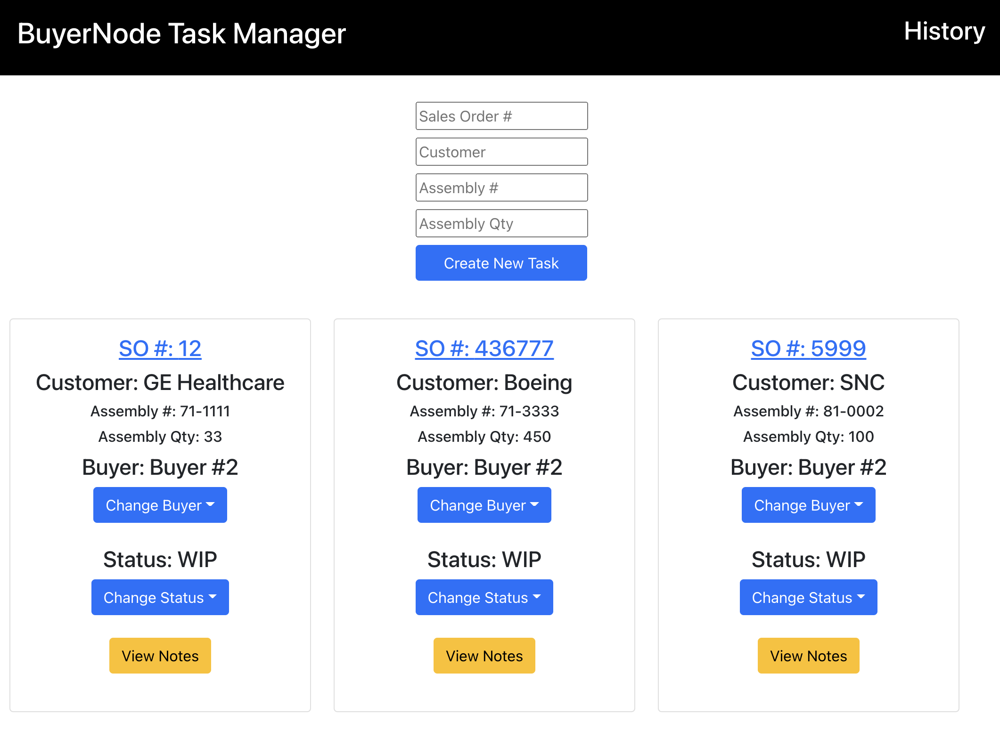
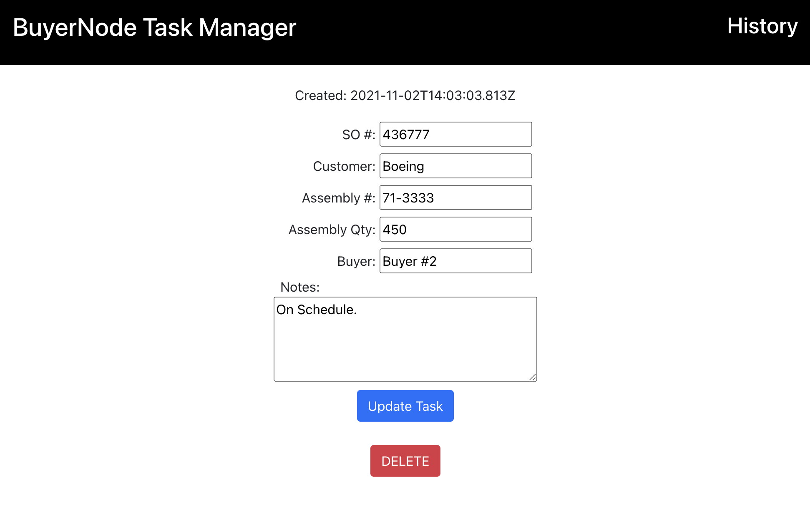

# BuyerNode Task Manager

Task manager to tracking buying activities for small design and manufacturing projects. 

The responsible buyer can be selected and the status can also be selected as WIP (work-in-progress)
or Complete (moves to History). Tasks can be added, deleted or edited as needed. Additional notes
can be viewed in a popup window.

# Technologies Used

- HTML
- CSS
- JavaScript
- React.js
- Bootstrap
- Node.js
- Express
- MongoDB
- Mongoose
- Heroku
- Netlify

# Screenshots

# Getting Started
[Click here](https://buyernode.netlify.com/) to see the deployed Project.

# Future Enhancements

- Connect to company ERP system database to automatically add new Sales Orders meeting certain
criteria to the the app as tasks.
- Send daily reminder emails from the app to the procurement team members.
